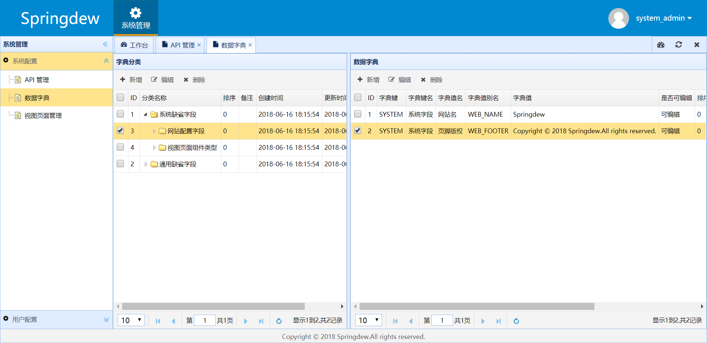

# Spiny
- 自己封装的 Java Web 平台快速开发脚手架，遵守[阿里巴巴 Java 开发规约](https://github.com/alibaba/p3c)。
- 严格的 RBAC （ Role-Based Access Control ，基于角色的访问控制）。
- 模块化开发。

|环境  |版本|
|:-----|---|
|Java  |1.8|
|MySQL |5.7|
|Maven |3.5|
|Tomcat|8.5|

|依赖            |版本         |
|:------------- |:------------|
|[Spring Boot](http://mvnrepository.com/artifact/org.springframework.boot/spring-boot)    |2.0.2.RELEASE|
|[Spring Web MVC](http://mvnrepository.com/artifact/org.springframework/spring-webmvc)     |5.0.8.RELEASE|
|[Spring Security Web](http://mvnrepository.com/artifact/org.springframework.security/spring-security-web)|5.0.7.RELEASE|
|[MyBatis](http://mvnrepository.com/artifact/org.mybatis/mybatis)        |3.4.6      |
|[Thymeleaf](http://mvnrepository.com/artifact/com.alibaba/druid-spring-boot-starter)      |3.0.9.RELEASE|
|[Druid](http://mvnrepository.com/artifact/com.alibaba/druid-spring-boot-starter)          |1.1.10       |

|测试账号     |        |                                       |
|:-----------|:-------|:--------------------------------------|
|Username    |Password|Role & Authority                       |
|system_admin|123456  |ROLE_USER,ROLE_ADMIN,ROLE_SYSTEM_ADMIN |
|admin       |123456  |ROLE_USER,ROLE_ADMIN,/user/delete/{id} |
|user        |123456  |ROLE_USER                              |

## TODO

## Development

### First steps
1. Windows/Linux/macOS
2. Java 8+
    - ``JAVA_HOME``
      > Linux
        
      OR
          
      ``%JAVA_HOME%``
      > Windows    
4. Maven 3.5+
    - ``M2_HOME``
      > Linux

      OR
     
      ``%M2_HOME%``
      > Windows
5. MySQL 5.7+
6. Tomcat 8.5+
    - `` sh ./startup.sh ``
      > Linux

      OR

      `` cmd startp.bat ``
      > Windows

## Installation ##
1. Windows/Linux/macOS
2. Java 8+
    - ``JAVA_HOME``
      > Linux
        
      OR
          
      ``%JAVA_HOME%``
      > Windows
3. MySQL 5.7+
4. Tomcat 8.5+
    - `` sh ./startup.sh ``
      > Linux

      OR

      `` cmd startp.bat ``
      > Windows

[CHANGELOG.md](https://github.com/godcheese/spiny/blob/master/CHANGELOG.md)

## Screenshots

